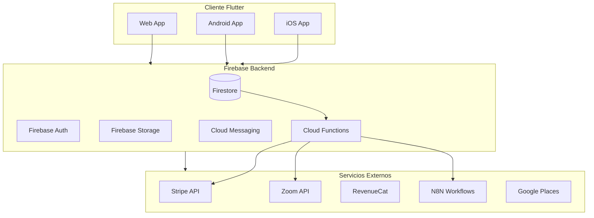
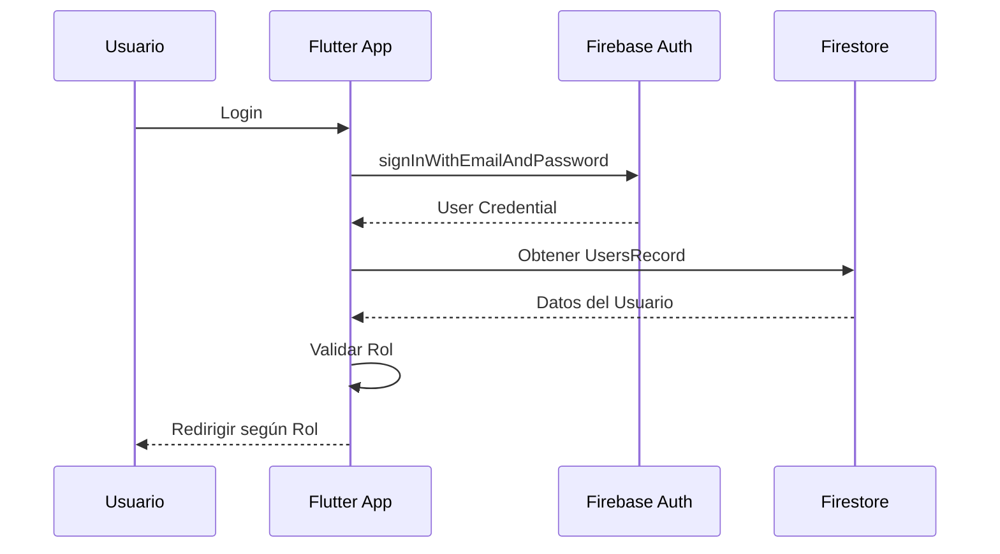
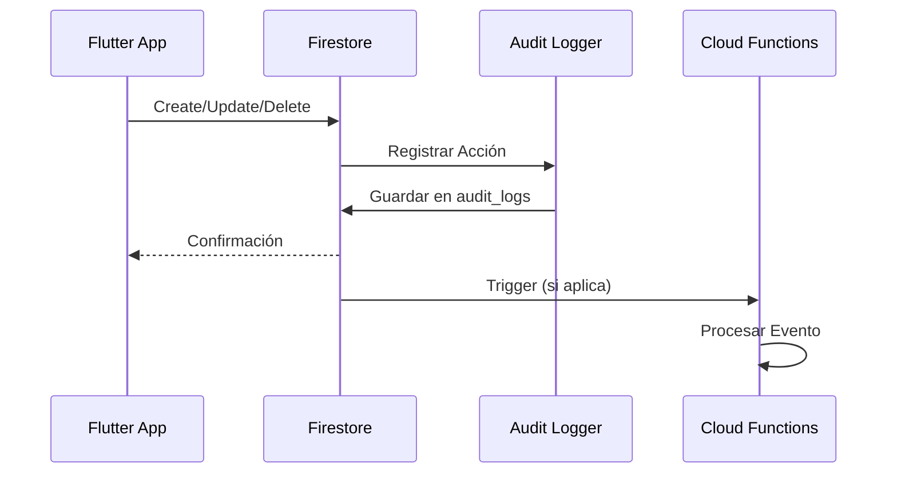

# Arquitectura del Sistema

## Visión General

CAPI App sigue una arquitectura cliente-servidor con backend serverless usando Firebase. La aplicación Flutter se comunica con Firebase para todas las operaciones de backend, y Firebase se integra con servicios externos para funcionalidades adicionales.

## Diagrama de Arquitectura



## Flujo de Datos

### Autenticación



### Operaciones CRUD



## Estructura de Base de Datos

### Colecciones Principales

- **users** - Usuarios del sistema (doctores, pacientes, asistentes)
- **clinicas** - Información de clínicas
- **citas** - Citas médicas
- **consultas** - Consultas médicas e historial clínico
- **chats** - Conversaciones de chat
- **servicios** - Servicios médicos ofrecidos
- **audit_logs** - Logs de auditoría
- **business_metrics** - Métricas de negocio

### Relaciones

```
clinicas (1) ──< (N) users
users (1) ──< (N) citas
users (1) ──< (N) consultas
users (1) ──< (N) chats
clinicas (1) ──< (N) servicios
```

## Sistema de Roles y Permisos

### Roles Disponibles

1. **Doctor** - Profesional de la salud
   - Variante: Doctor Admin (isAdmin: true)
2. **Paciente** - Usuario paciente
3. **Asistente** - Asistente de clínica

### Permisos Granulares

El sistema incluye 15+ permisos específicos:
- `verCitas`, `crearCitas`, `editarCitas`, `eliminarCitas`
- `verPacientes`, `crearPacientes`, `editarPacientes`
- `verConsultas`, `crearConsultas`, `editarConsultas`
- `verEquipo`, `gestionarEquipo`
- `verServicios`, `gestionarServicios`
- `configurarClinica`
- `todos` (permiso maestro)

## Patrones de Diseño

### State Management
- **Provider** - Para estado global
- **FlutterFlow State** - Para estado de páginas
- **Streams** - Para datos en tiempo real de Firestore

### Servicios
- **Singleton Services** - Para servicios compartidos
- **Repository Pattern** - Para acceso a datos
- **Service Layer** - Para lógica de negocio

## Seguridad

### Firestore Security Rules
- Validación por rol
- Validación por pertenencia a clínica
- Validación de permisos específicos
- Auditoría de acceso

### Autenticación
- Firebase Auth con email/password
- Reautenticación para operaciones sensibles
- Validación de sesión en todas las operaciones

## Integraciones

### Stripe
- Webhooks para eventos de suscripción
- Stripe Connect para pagos paciente-doctor
- Sincronización de estado de suscripciones

### Zoom
- API para creación de reuniones
- Enlaces instantáneos por clínica
- Configuración por clínica

### RevenueCat
- Sincronización de compras iOS
- Webhooks para eventos de suscripción
- Validación de entitlements

### N8N
- Workflows para automatización
- Webhooks para eventos del sistema
- Emails automáticos

## Próximos Pasos

1. [Instalación y Configuración](./03-instalacion-configuracion.md) - Configura tu entorno
2. [Estructura del Proyecto](./04-estructura-proyecto.md) - Conoce la organización del código

---

**Anterior:** [Introducción ←](./01-introduccion.md) | **Siguiente:** [Instalación y Configuración →](./03-instalacion-configuracion.md)

